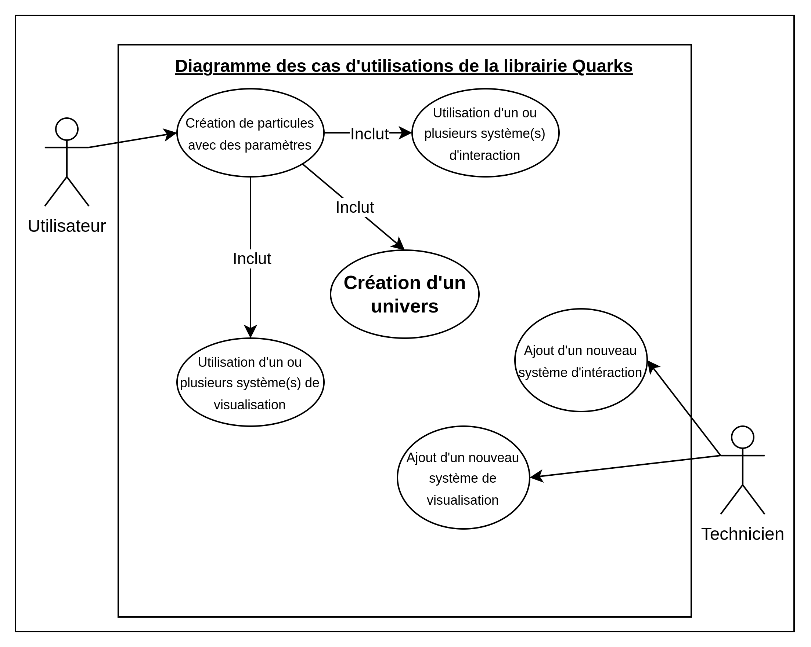
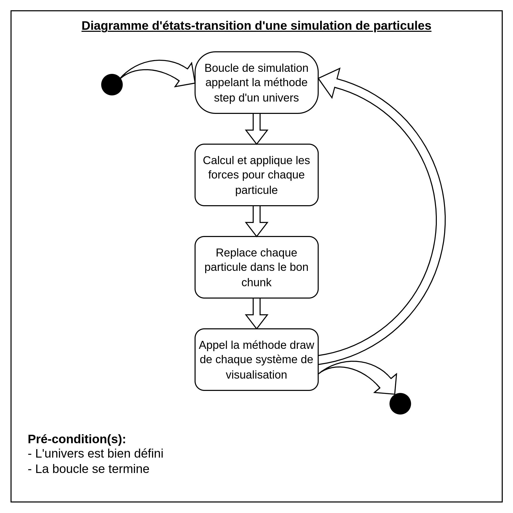
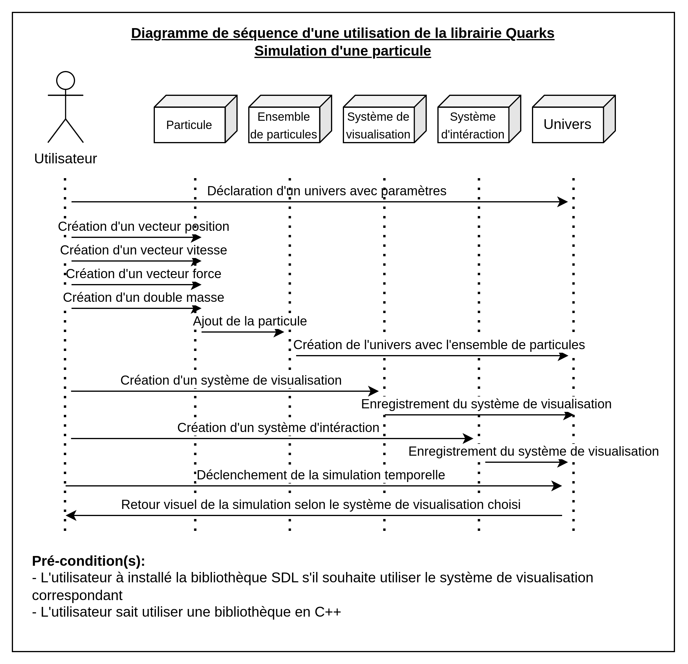
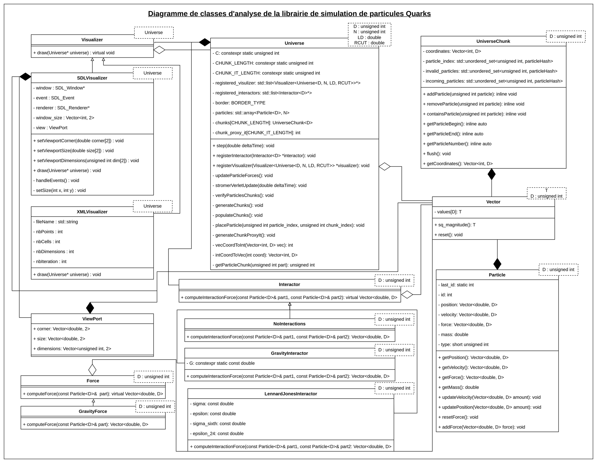

# <center>Quark</center>

### <center>Implémentation d'une librairie de simulation de particules</center>

## Introduction

Quark est une librairie "header-only" de simulation de particules, donnant accès aux fonctionnalités de base ainsi qu'a une simplicité de rajouter ses propres systèmes. 

A son coeur, cette librairie est une collection de particules qui possèdent force, vitesse et position, et auxquelles on applique les force d'interactions données.

## Exemple d'utilisation :

```c++
// Tout d'abord, il est pratique de définir le type d'univers que l'on va utiliser, car on peut se retrouver à le ré-écrire plusieurs fois.
// les paramètres template sont la dimension, le nombre de particule, la longueur caractéristique et le rayon de coupe.
typedef Universe<2, 3000, 1.0, 0.2> MyUniverse;

// Ensuite, on instancie notre univers. Avec le constructeur par défaut, il va générer le nombre de particules demandés dans le cube [0, 1]^D .
MyUniverse universe = MyUniverse();

// On peut ensuite rajouter autant d'intéracteurs que l'on veut. Il existe des interacteurs par défaut, mais il est possible de créer ses propres interacteurs.
GravityInteractor<2> interactor = GravityInteractor<2>();
universe.registerInteractor(&interactor);

// de même pour la visualisation.
SDLVisulizer<MyUniverse> visulizer = SDLVisulizer<MyUniverse>();
universe.registerVisualizer(&visulizer);

// Enfin, on lance la simulation en appelant la méthode "step" de l'univers.
for(unsigned int i = 0; i < 1000; i++) {
    universe.step(0.0000001);
}

```

## Lab 1 - Introduction

Une remise à plat du C/C++, ainsi que des débuts d'algorithme d'EDO.

## Lab 2 - Particules et Collections

Création de la classe particule. Cette classe a évolué au fil du temps. 

On teste les performances d'ajout de particules à une liste pour différents nombres de particules:

    nbParticles = 64        -> Mesure : 0.000371615s
    nbParticles = 128       -> Mesure : 0.000774339s
    nbParticles = 1024      -> Mesure : 0.00566584s
    nbParticles = 2048      -> Mesure : 0.0103812s
    nbParticles = 4096      -> Mesure : 0.0159918s
    nbParticles = 32768     -> Mesure : 0.0683438s

On commence ainsi à avoir une véritable différence de performances pour 2048 particules en 
arrivant au centième de seconde de temps de calcul.

Après analyse, nous avons décidé d'utiliser une `std::array` pour stocker les particules, car nous connnaissons leur nombre et il ne risque pas de changer.

L'algorithme de Stromer-Verlet nous donne le mouvement des particules, et est encore à ce jour utilisé. Seulement, il a été déporté dans la classe Univers, et l'exemple du système solaire est aussi adapté avec la version évoluée de Quark.  

## Lab 3 - Vecteur et Opérateur

Création de la classe Vecteur. Pour un maximum d'abstraction, nous avons rendu ce vecteur template de la dimension et du type contenu. Ainsi, il a pu être réutilisé proprement à différents endroits, sans avoir à le ré-écrire. 

En plus des opérateurs classique, nous avons mis la possibilité de hasher ce vecteur, afin qu'il puisse être utilisé comme clé dans les hash map. Au final, ça ne nous seras plus utile.

La classe particule a ainsi été modifié pour utiliser des vecteurs. 

Nous avons également créé la classe univers, qui stocke les particules et fait tourner la simulation. Pour diviser par deux le temps de calcul, nous ne calculons l'interaction entre la particule i et la particule j que si i < j et nous appliquons la force calculé aux deux particules.

## Lab 4

Nous avons implémenté le maillage de l'univers.

Après plusieurs itérations et tentatives d'optimisation, actuellement le nombre de chunks est calculé à la compilation, et stocké dans un tableau. Cela donne de bien meilleurs temps d'accès et itération que la hash map précédement utilisé, mais cela a demandé plus de mise en place et de calcul lors de la création de l'univers, ainsi que des calculs fait à la compilation.

## Lab 5

Pour l'implémentation de tests nous utilisons CTest. Ainsi en effectuant make test nous vérifions le bon fonctionnement de la classe Vector.

Le système de visualisation implémenté dans la classe XMLVisualizer permet de générer un ensemble de fichiers .vtu permettant une visualisation de la simulation a posteriori. 

A partir de notre implémentation de librairie de simulation de particules nous obtenons les diagrammes suivants :





## Lab 6

Nous avons rajouté les conditions aux limites. Lors de la relocalisation des particules dans les chunks, si nous avons des bordures absorbantes ou périodiques, nous enlevons les particules ou les replaçons. De plus, lors du calcul des forces des particules, si nous avons des bordures réflexives, nous ajoutons la force correspondante à chaque particule. 

Après avoir comparé les deux méthodes réflexives, celle avec le potentiel permet des transitions beaucoup plus lisses. Cependant, elle est aussi plus faillible. Certaines particules peuvent passer au travers, lorsqu'elle sont poussé par d'autres particules.

Pour ajouter un potentiel gravitationnel, nous avons rajouté toute la structure des `Forces`. Les Forces fonctionnent comme nos interacteurs, sauf qu'elles agissent sur une seule particule. Nous pouvons donc égallement enregistrer autant de Forces que l'on souhaite. Finalement, nous avons créé la classe Force Gravitationnelle qui est une force simulant la gravité sur les particules. Cela nous donne une structure extensible qui nous permet d'avoir les comportements demandés.

Finalement, nous avons ajouté la limite d'énergie cinétique cible comme demandé.